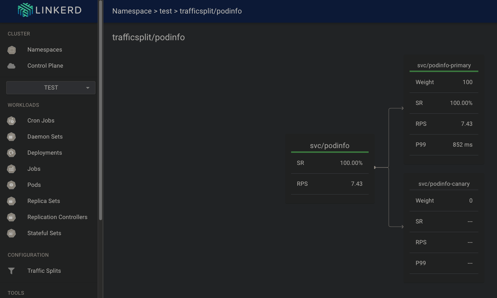

# CRD & Controller

This project includes solutions for the following exercises:

* Exercise 5.01: DIY CRD & Controller
* Exercise 5.03: Learn from external material

---

## Q/A exersices

In this section, please forgive my knowledge limitation if you found unreasonable somewhere.

### Exercise 5.03: Learn from external material
`-k` in `kubectl -k` is a shorthand for `--kustomize`. This tell `kubectl` to read the configuration from [linkerd repo](https://github.com/fluxcd/flagger/blob/main/kustomize/linkerd/kustomization.yaml) where the instruction for installation/destruction is given following `apply`/`delete` command.

I am not familiar with script command so here is the screenshot at the end of the task regarding canary release in Service Meshes.

